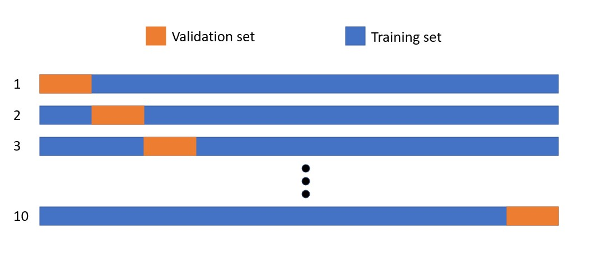

```{r setup, include=FALSE}
knitr::opts_chunk$set(warning = FALSE, message = FALSE) 
```

```{r libraries}
library(readxl)
library(dplyr)
library(caret)
library(randomForest)
library(tidyverse)
library(rpart)
library(rpart.plot)
library(smotefamily)
library(mlbench)
library(performanceEstimation)
library(rattle)
```

# Introduction

Male and female infertility has been rising over the recent decades. Scientific American states that "the whole spectrum of reproductive problems in males are increasing by about 1 percent per year in Western countries," (Swan, Colino 2021). While seemingly small, this number adds up over the decades to an extremely significant concern. Further, fertility issues can be linked to serious underlying medical troubles and should not be overlooked. Therefore, it is exceptionally important to study what factors may be impacting fertility.

### Method

This project aims to contribute to the identification of male fertility problems initially explored in Gil et al. (2013) by using a random forest method for classification prediction modeling, as laid out in Liaw (2002).

Random forests are an "ensemble" learning method for classification which have been found to be useful high-dimensional datasets and can handle binary, categorical, and numerical factors with very little pre-processing. It's a quick way to train a model and it is robust to outliers and non-linear data, (Kho 2018).

Gil et al. (2013) used this data in conjunction with multiple artificial intelligence methods (Multilayer Perceptron, Support Vector Machines, and Decision Trees) to compare their efficacy for predicting seminal quality. These methods were shown to have high accuracy but low specificity and positive predictive value. The authors posit that this may be due to the imbalanced nature of the data.

By utilizing random forests along with methods of balancing data, it may be possible to improve specificity and positive predictive value.

### Data description

Using semen quality as a predictor for male fertility potential, [data collected by David Gil et al. (2013)](https://archive.ics.uci.edu/ml/datasets/Fertility) will be used to train a random forest model for classifying semen quality. The data was collected from 100 volunteer sperm donors between 18 and 36 years of age.

It consists of **10** variables:

1.  **season** when the analysis was performed
2.  **age** at the time of analysis
3.  childish **diseases** (i.e., chicken pox, measles, mumps, polio) (binary: yes, no)
4.  accident or serious **trauma** (binary: yes, no)
5.  **surgical** intervention (binary: yes, no)
6.  recency of high **fevers**
7.  frequency of **alcohol** consumption
8.  **smoking habit**
9.  number of hours spent **sitting** per day
10. Response: **diagnosis** (binary: normal, abnormal).

The first 9 of these variables are predictor variables while the 10th is the response variable.

Here are a few inputs to be able to quickly change our hyperparameters throughout:

```{r inputs}
m = 3 # Number of drawn candidate variables in each split
ntree = 1000 # Number of trees in the random forest
minsplit = 1 # The minimum number of data points required to attempt a split before it is forced to create a terminal node. Default is 20.
```

Let's import our data and transform the response to a binary factor.

```{r fert}
fert <- read_excel("fertility_Diagnosis.xlsx")
# Turn 'N' and 'O' in diagnosis to binary response where 'N'=0 and 'O'=1
fert$diagnosis <- as.factor(fert$diagnosis)
fert$season <- as.factor(fert$season)
fert$chld_dis <- as.factor(fert$chld_dis)
fert$trauma <- as.factor(fert$trauma)
fert$surgery <- as.factor(fert$surgery)
fert$fevers <- as.factor(fert$fevers)
fert$smoking <- as.factor(fert$smoking)
fert <- fert %>% 
  dplyr::mutate(diagnosis = recode(diagnosis, "N"="0", "O"="1"))
head(fert)
```

### Imbalanced Data

Unbalanced data can cause problems in classification. When there is a large disparity in the frequencies of the observed classes, **classification models will almost always favor the majority class** in its predictions unless extra steps are taken in the pre-processing of the data.

In our data set, when diagnosis = '0' this indicates normal seminal quality, while diagnosis = '1' indicates abnormal seminal quality. We will likely need to take extra steps to compensate for the imbalanced nature of the data.

**Our data set contains 88 normal samples and 12 abnormal samples.**

```{r sampletable_fert}
print(table(fert$diagnosis))
```

So the respective proportions of normal and abnormal classes are .88 and .12.

```{r proptable_fert}
print(prop.table(table(fert$diagnosis)))
```

```{r fert_class_freqs}
barchart(fert$diagnosis, main='Frequency of Abnormal vs. Normal Samples')
```

## Partitioning the Data

This imbalance in the data will likely cause problems in training and testing data, as our classification model will favor the majority class. 

Let's first create train and test sets of this data without making any efforts to balance the response. We partition the data in [one of three commonly used fashions](https://machinelearningmastery.com/train-test-split-for-evaluating-machine-learning-algorithms/):

-   Train: 67% Test: 33%

```{r train_test_part}
set.seed(123)
partition <- createDataPartition(fert$diagnosis, p = .67, 
                                  list = FALSE, 
                                  times = 1)
imbal_train <- fert[as.vector(partition),] 
imbal_test <- fert[-as.vector(partition),] 
```

Using the function createDataPartition partitions the data in such a way as to maintain the class proportions in the original data set when partitioning to the train and test sets.

Class proportions for training set:

```{r imbal_train_prop_table}
imbal_train_prop_table <- table(imbal_train$diagnosis)
imbal_train_prop_table 
```

Class proportions for testing set:

```{r imbal_test_prop_table}
imbal_test_prop_table <- table(imbal_test$diagnosis)
imbal_test_prop_table 
```

## Decision Trees

Decision Trees are at the heart of random forests, so lets see what one looks like.

A decision tree uses a set of if-else conditions to visualize and classify data according to conditions.

Here is a decision tree built from our imbalanced training data.

```{r decisiontree}
set.seed(23)
dec_tree <- train(diagnosis~.,data=imbal_train, method = 'rpart', 
                  control=rpart.control(minsplit =1,  minbucket = 4))
fancyRpartPlot(dec_tree$finalModel, sub= 'Decision Tree')
```

The root node is age, and this tells us that from this data age was found to be the most influential variable in predicting seminal quality.

87% of the training set have normal seminal quality, while 13% have abnormal quality. The root node asks if the subject is under age .66 (=roughly 30 years old). If yes, then you go to the left "child" node. This node tells us that of the 47% of subjects who are under 30, 97% of them have normal sperm quality and 3% have abnormal.

As for the 53% of subjects older than 30, 78% have normal and 22% have abnormal. Of these subjects, the question of whether the subject sits less than .28(= about 5.2 hours) per day. If yes, travel down to the left terminal node.

26% of total subjects are over age 30 *and* sit *less* than 5.2 hours per day, and of those subjects 94% have normal seminal quality and 6% have abnormal. 26% of total subjects are over age 30 *and* sit *more* than 5.2 hours per day, and of those subjects 61% have normal seminal quality and 39% have abnormal.

Finally, the last question is asked of subjects older than 30 who sit more than 5.2 hours per day: Is their alcohol consumption greater than or equal to 0.9 (where 0.9 falls on a scale of 0 to 1 where 0 is drinking several times a day and 1 is never or hardly ever drinking.)

So, 12% of all the subjects are over age 30 *and* sit *more* than 5.2 hours per day *and* rarely drink. Of these 12%, 88% have normal quality and 12% have abnormal.

15% of all subjects are over age 30 *and* sit *more* than 5.2 hours per day *and* drink more often than rarely. Of these subjects, 40% have normal semen quality and 60% have abnormal.

Let's use this tree to predict abnormal seminal quality in our training set:

```{r decision_tree_test}
dt_test_pred <- predict(dec_tree, imbal_test, type="raw")
dt_pred_cm <- confusionMatrix(dt_test_pred, imbal_test$diagnosis, positive="1")
dt_pred_cm
```

Using this tree on the test data set, we get a prediction **accuracy** of 78%, **sensitivity** of 66.7%, and **specificity** of 79%. The accuracy is the overall percentage of correct guesses. Sensitivity is the percentage of true positives that were guessed correctly and specificity is the number of true negatives guessed correctly. 

Nodes make their splitting decisions based on their "Gini index." This is a measure of what is known as "node purity," which put simply is the probability that a feature was classified incorrectly.

### Gini index

$$
  G = 1-\sum_{k=1}^{K}(p_k)^2
$$ 

"Purer" nodes have smaller Gini indexes.

Decision trees are useful because they are easy to interpret and provide a clear path to the classification of a subject, but they tend to perform poorly when moving from training to test data. They tend to overfit the training set, which leads to increased variance. Random forests can be used to decrease this variability.

# Random Forests

A random forest basically makes decisions about classification by building many decision trees using 'bagging' (bootstrapping and aggregating). Here are the steps:

1. **We make a bootstrapped training dataset.** This dataset is the same size as the original training dataset, but it is built by randomly sampling from the original dataset *with replacement*.
2. **Build a decision tree using that dataset**, but instead allowing any variable to be the root node choose a random subset from which to select candidates for the root node and subsequent nodes. 
3. **Repeat!** With however many trees you want in your forest.
4. The test dataset is **run through each tree in the random forest**. Votes of each tree for each datum are **aggregated** and a final vote is made based on the majority vote. 

## Imbalanced Random Forest

Now we will attempt to perform random forest classification using these imbalanced training and testing sets. A random forest is essentially a large collection of decision trees where at each stage of the tree construction process we randomly select which variables to consider. To do this, the parameter "mtry" is set to a number less than the number of independent variables in the data set. Typically this value is chosen as 1/3 of the available variables. Since we have 9 independent variables in our data, we will set it to mtry=3.

Here is the creation of the random forest:

```{r imbal_train_rf}
set.seed(4564)
imbal_train_forest <- randomForest(diagnosis ~ ., 
                  data=imbal_train, 
                  mtry=3, 
                  importance=TRUE,
                  keep.Forest=TRUE,
                  ntree= ntree,
                  nodesize=2)
imbal_train_forest
```

```{r imbal_imp_plot}
imbal_imp <- as.data.frame(imbal_train_forest$importance) %>% 
  arrange(desc(MeanDecreaseGini))

imbal_imp <- tibble::rownames_to_column(imbal_imp, "variable")
ggplot(data=imbal_imp) + geom_bar(aes(x=reorder(variable, MeanDecreaseAccuracy), y=MeanDecreaseAccuracy), stat = "identity") + coord_flip()
```


Now we use this random forest based on the imbalanced dataset to make a prediction using the imbalanced test data.

```{r imbal_pred_cm}
imbal_test_pred <- predict(imbal_train_forest, imbal_test, type="class")
imbal_pred_cm <- confusionMatrix(imbal_test_pred, imbal_test$diagnosis, positive="1")
imbal_pred_cm
```

Wow, our model is almost 90% accurate!! Not so fast. None of the values that were actually positive were predicted to be positive, which is why our sensitivity is 0. Most likely, this is due to the algorithm "preferring" the majority class.

What can we do to boost this metric?

## K-Fold Cross Validation

Gil et al. (2013) utilized an approach called K-Fold Cross Validation in their report on predicting seminal quality with artificial intelligence methods. The three AI approaches they covered were (1) Decision Trees, (2) Multilayer Perceptron, and (3) Support Vector Machines.

Instead of the validation set approach we used above, Gil et al. used K-Fold Cross Validation as their model evaluation method, with k=10. Instead of splitting the data into train and test sets *once*, this approach does it k times.

```{r}

```

While this approach can be a good choice for small datasets like this one, it is not well suited to imbalanced data. More information on how k-fold cross validation works can be found here: [link] <https://www.geeksforgeeks.org/k-fold-cross-validation-in-r-programming/>

We would like to compare the results of using random forests with the methods used in Gil et al., so here we will use cross validation as our model evaluation approach. A video of the approach used can be found here: [link]<https://www.youtube.com/watch?v=M7BMgHwXUoY>

```{r kfoldcrossvalrf}
set.seed(123)
fitControl <- trainControl(method='cv',
                             number=10,
                             search='random',savePredictions=T)
modelFitrf <- train(diagnosis ~ ., data=fert,
                    method='rf',
                    trControl= fitControl, tuneLength=10, ntree=ntree,control = rpart.control(minsplit =2, 
              minbucket = 2))
```

From this model we can extract the optimal value of mtry, which is found to be 3.

```{r kfoldtune}
modelFitrf$bestTune
```

And create a plot of what are found to be the most important variables. Age and the amount of time spent sitting each days are the most impactful.

```{r kfoldvar_importance}
plot(varImp(modelFitrf, scale=F), main= "Var Imp: RF 10 fold CV")
```

The optimal value of mtry is used to predict the dataset.

```{r kfold_cm}
sub_rf1= subset(modelFitrf$pred, modelFitrf$pred$mtry==modelFitrf$bestTune$mtry)
kfold_cm <- confusionMatrix(table(sub_rf1$pred,sub_rf1$obs),positive="1")
kfold_cm
```

Okay, this is still not great, but it's also not surprising since k-fold cross-validation isn't a good choice for imbalanced data. We will have to use another method for our approach.

## Resampling

Let's try resampling our dataset. There are two main methods of resampling for even-ing out the dataset. 

1. **Down-sampling:** This is where we delete instances of the majority class (i.e. delete rows of our dataframe where the response is "Normal" until there is balance between the two classes) 
2. **Up-sampling:** This is where we add copies of instances of the minority class (i.e we add copies of rows where the response is "Abnormal" until there is balance between the two classes)

Let's try both and see which delivers the best results. The method used for this approach and more information on it can be found here: [link]<https://topepo.github.io/caret/subsampling-for-class-imbalances.html>

### Down-Sampling

Starting with creating a down-sampled training set. Note that down-training and up-training are most applied to the training set after the data has been split into it's training and test sets.

```{r}
set.seed(3240)
down_train <- downSample(x = imbal_train[, -ncol(imbal_train)],
                         y = imbal_train$diagnosis)
table(down_train$Class) 
```
Our down-sampled training set has 9 normal and 9 abnormal observations. 

```{r}
set.seed(324)
down_forest <- randomForest(Class ~ ., 
                  data=down_train, mtry=modelFitrf$bestTune$mtry, 
                  importance=TRUE,
                  keep.Forest=TRUE,
                  ntree=1000)
```

```{r}
down_test_pred <- predict(down_forest, imbal_test, type="class")
down_pred_cm <- confusionMatrix(down_test_pred, imbal_test$diagnosis, positive="1")
down_pred_cm
```

Using this to train a random forest and applying it to our test set results in an accuracy of 68.75%, sensitivity of 100%, and specificity of 65.5%.  These are the best results we have seen so far, although it must be noted that there is a trade-off between achieving higher sensitivity and a resulting lowered specificity. In real world situations, however, it may be preferred to have a lower specificity if it means lowering the rate of false negatives.


### Up-Sampling

```{r}
set.seed(3243)
up_train <- upSample(x = imbal_train[, -ncol(imbal_train)],
                     y = imbal_train$diagnosis)                         
table(up_train$Class) 
```
Our up-sampled training set has 59 normal and 59 abnormal observations. 

```{r}
set.seed(98)
up_forest <- randomForest(Class ~ ., 
                  data=up_train, mtry=modelFitrf$bestTune$mtry, 
                  importance=TRUE,
                  keep.Forest=TRUE,
                  ntree=1000,
                  nodesize=1)
```

```{r}
up_test_pred <- predict(up_forest, imbal_test, type="class")
up_pred_cm <- confusionMatrix(up_test_pred, imbal_test$diagnosis, positive="1")
up_pred_cm
```

Applying the up-sampled trained random forest to the test set results in an accuracy of 81%, sensitivity of 0%, and specificity of 89.7%. Training the data with replications of the abnormal classifications has resulted in far worse predictions than trading the data with fewer normal classifications, as with down-sampling.

### SMOTE 

A hybrid approach to re-sampling is something called SMOTE (synthetic minority over-sampling technique). The general idea of this method is to artificially generate new examples of the minority class using the nearest neighbors of these cases. Furthermore, the majority class examples are also under-sampled, leading to a more balanced dataset.

```{r}
set.seed(98960)
smote_train <- smote(diagnosis ~ ., data  = imbal_train, k=8)                         
table(smote_train$diagnosis) 
```
Our SMOTEd training set has 36 normal and 27 abnormal observations. 

```{r}
set.seed(26633)
smote_forest <- randomForest(diagnosis ~ ., 
                  data=smote_train, mtry=modelFitrf$bestTune$mtry, 
                  importance=TRUE,
                  keep.Forest=TRUE,
                  ntree=1000,
                  nodesize=1)
```

```{r}
smote_test_pred <- predict(smote_forest, imbal_test, type="class")
smote_pred_cm <- confusionMatrix(smote_test_pred, imbal_test$diagnosis, positive="1")
smote_pred_cm
```

The results of this approach are accuracy of 75%, sensitivity of 33%, and specificity of 79%.

## Balanced Bootstrap Sampling 

The last technique we used was balanced bootstrap sampling, where each random forest tree is built from a bootstrap sample containing the same number of normal and abnormal classifications (Scott 2017). Cases are drawn with replacement from each class, and we set this value equal to the size of the minority class. This is implemented using the sampsize argument from the randomForest package.

```{r}
set.seed(34324)
ssweights <- c(imbal_train_prop_table[['1']],imbal_train_prop_table[['1']])
weighted_forest <- randomForest(diagnosis ~ ., 
                  data=imbal_train, mtry=modelFitrf$bestTune$mtry, 
                  importance=TRUE,
                  keep.Forest=TRUE,
                  ntree=1000,
                  nodesize=1,
                  sampsize=ssweights)
weighted_forest
```


```{r}
weighted_test_pred <- predict(weighted_forest, imbal_test, type="class")
weighted_pred_cm <- confusionMatrix(weighted_test_pred, imbal_test$diagnosis, positive="1")
weighted_pred_cm
```

Results of this technique are accuracy of 81%, sensitivity of 66.7%, and specificity of 82.8%. Figure 9. This appears to achieve a happy medium between accuracy, sensitivity, and specificity.

# Conclusion

The overall comparison of these methods can be seen below. From this table we can see that there are a lot of challenges in finding the right balance between Sensitivity and Specificity when dealing with a small, imbalanced dataset like this. The approaches with the best results appear to be the down-sampled random forest and the balanced bootstrap sampling random forest. The down-sampled random forest may be most appropriate for real world situations if the goal is to flag possible abnormal sperm quality for further examination and testing, as the rate of false negatives is lowest using this approach. 

```{r accuracy, include=FALSE}
imbal_overall <- imbal_pred_cm$overall
imbal_accuracy <- imbal_overall[['Accuracy']]

kfold_overall <- c(kfold_cm$overall)
kfold_accuracy <- kfold_overall[['Accuracy']]

down_overall <- down_pred_cm$overall
down_accuracy <- down_overall[['Accuracy']]

up_overall <- up_pred_cm$overall
up_accuracy <- up_overall[['Accuracy']]

weighted_overall <- weighted_pred_cm$overall
weighted_accuracy <- weighted_overall[['Accuracy']]

smote_overall <- smote_pred_cm$overall
smote_accuracy <- smote_overall[['Accuracy']]

accuracy <- c(imbal_accuracy, kfold_accuracy, down_accuracy, up_accuracy, weighted_accuracy, smote_accuracy)
accuracy
```


```{r sensitivity, include= FALSE}
imbal_byclass <- imbal_pred_cm$byClass
imbal_sens <- imbal_byclass[['Sensitivity']]

kfold_byclass <- kfold_cm$byClass
kfold_sens <- kfold_byclass[['Sensitivity']]

down_byclass <- down_pred_cm$byClass
down_sens <- down_byclass[['Sensitivity']]

up_byclass <- up_pred_cm$byClass
up_sens <- up_byclass[['Sensitivity']]

weighted_byclass <- weighted_pred_cm$byClass
weighted_sens <- weighted_byclass[['Sensitivity']]

smote_byclass <- smote_pred_cm$byClass
smote_sens <- smote_byclass[['Sensitivity']]

sensitivity <- c(imbal_sens,kfold_sens, down_sens, up_sens, weighted_sens, smote_sens)
sensitivity
```


```{r specificity, include= FALSE}
imbal_spec <- imbal_byclass[['Specificity']]
kfold_spec <- kfold_byclass[['Specificity']]
down_spec <- down_byclass[['Specificity']]
up_spec <- up_byclass[['Specificity']]
weighted_spec <- weighted_byclass[['Specificity']]
smote_spec <- smote_byclass[['Specificity']]

specificity <- c(imbal_spec, kfold_spec, down_spec, up_spec, weighted_spec, smote_spec)
specificity
```


```{r comparison_dataframe}
examples <- c('Imbalanced RF', 'K-Fold RF', 'Down-Sampled RF', 'Up-Sampled RF', 'Balanced Bootstrap RF', 'SMOTE RF')
metrics <- c('Accuracy', 'Sensitivity', 'Specificity')


comparison_df <- data.frame(Method = examples, Accuracy = accuracy, Sensitivity = round(sensitivity,4), Specificity = round(specificity,4))
comparison_df
```


